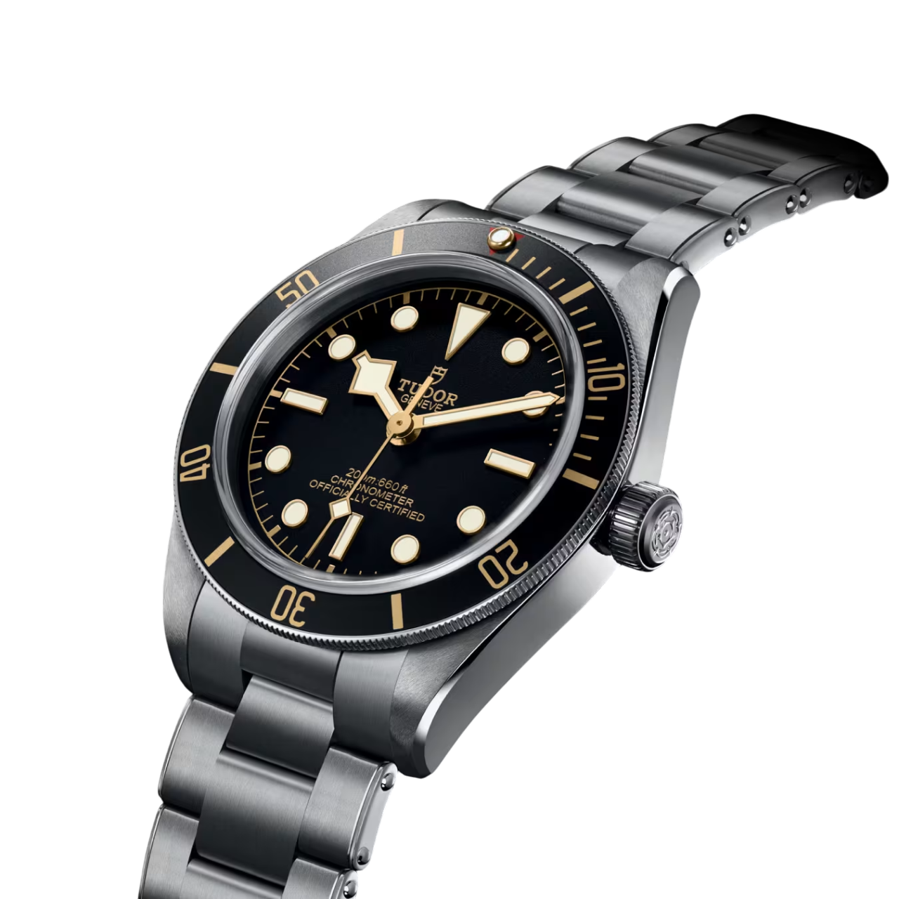
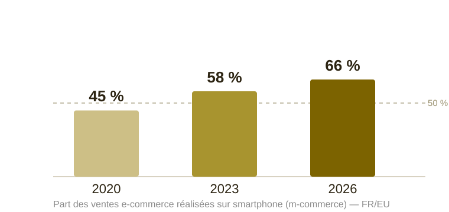
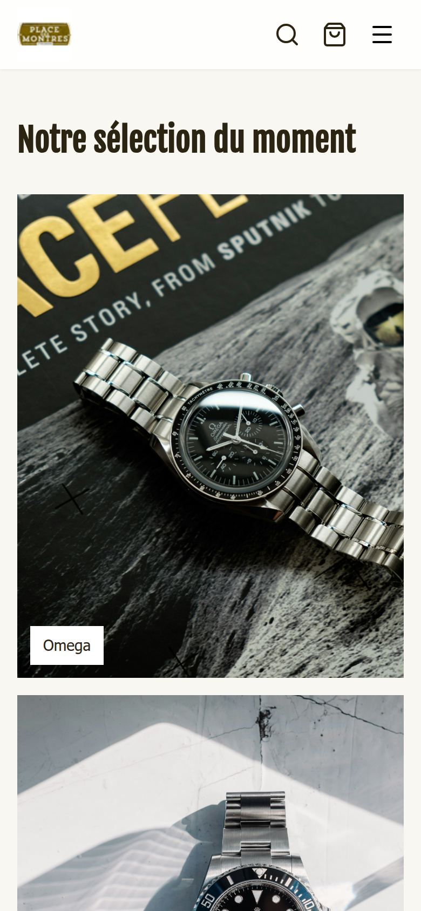
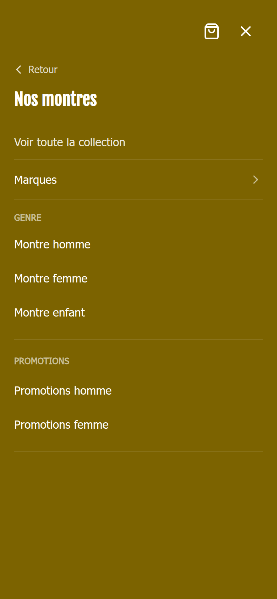
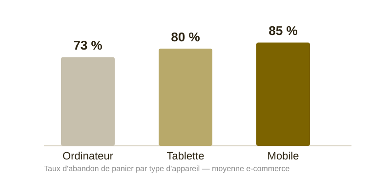
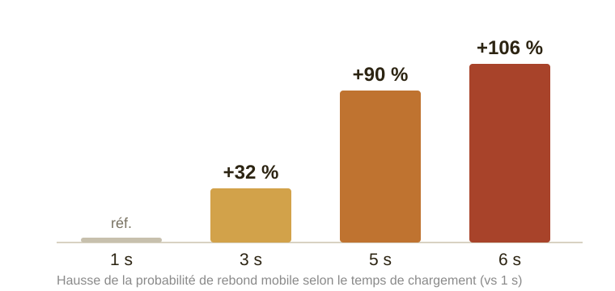
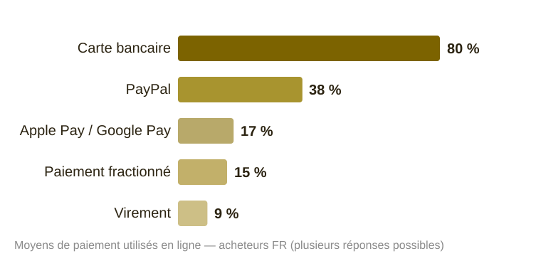

<!-- _class: cover -->
<!-- _paginate: false -->
<!-- _header: '' -->
<!-- _footer: '' -->

Présentation commerciale

# Place des Montres

Une boutique en ligne à la hauteur de votre expertise <strong>depuis 1995</strong>

Une solution e-commerce <strong>sur-mesure</strong>, dédiée à votre maison — hébergement, maintenance et évolutions inclus.

Présenté par Doryan Dillen · <a href="mailto:doryandillen@gmail.com">doryandillen@gmail.com</a>

---

## Nous comprenons votre métier

| Ce que vous faites                  | Ce que votre site couvre                                  |
| ----------------------------------- | --------------------------------------------------------- |
| ~3 000 références, ~30 marques      | Catalogue retail, filtres marque / genre / promo          |
| Conseil en magasin + vente en ligne | Pages À propos, Services, Guide de l'horloger             |
| Atelier réparation aux Halles       | Mise en avant pile, étanchéité, réparation                |
| Colissimo + retrait magasin         | Checkout : domicile (gratuit dès 80 €) + retrait boutique |
| Garantie 2 ans, retour 30 jours     | Blocs confiance fiche produit + FAQ (15 questions)        |

> **Notre atout :** votre futur site est **déjà dessiné pour vous** — identité, textes et règles métier repris fidèlement de placedesmontres.fr.

---

## Le constat : PrestaShop en 2026

**Ce qui fonctionnait hier pèse aujourd'hui sur votre temps et votre image.**

- **Maintenance technique** — mises à jour cœur, modules, thème custom, correctifs sécurité
- **Back-office générique** — pas pensé pour piloter 3 000 montres, promos par marque, carrousel d'accueil
- **Expérience mobile datée** — navigation marques peu fluide, parcours d'achat lent
- **Performance catalogue** — lenteur perçue, impact SEO et conversion
- **Hébergement à votre charge** — serveur, sauvegardes, SSL, incidents
- **Évolutions coûteuses** — chaque nouveauté = développement sur mesure

> *« Votre cœur de métier, c'est la montre — pas les mises à jour PHP. »*

---

## Ce que vos clients attendent en 2026

1. **Rapidité** — catalogue fluide sur mobile, recherche instantanée, paiement en 2 minutes
2. **Confiance** — garanties visibles, Stripe, politique retour claire
3. **Continuité boutique / web** — ajustement bracelet, retrait magasin, guide entretien

Plus de **60 %** du trafic e-commerce mode & accessoires se fait sur mobile — un site lent ou peu lisible, ce sont des ventes perdues **en ligne et en boutique** (clients qui comparent avant de passer aux Halles).

---

## Le mobile est devenu la norme

**Le smartphone n'est plus un canal secondaire : c'est le premier écran de vos clients.** La part des achats finalisés sur mobile progresse chaque année.

> Sur PrestaShop, ce trafic mobile arrive sur un parcours pensé pour l'ordinateur. C'est exactement là que se perdent les ventes.

<small>Sources : observatoires e-commerce FR/EU 2020–2025 — ordres de grandeur.</small>

---

## Votre site sur mobile — réel, pas une maquette

**Chaque écran est d'abord conçu pour le pouce.** Captures réelles de votre site — accueil et menu :

- **Mega-menu tactile** — marques, genre, promos en un geste
- **Recherche instantanée** — la bonne montre en quelques lettres
- **Achat toujours à portée** — bouton panier collant en bas d'écran
- **Checkout en 2 min** — Apple Pay / Google Pay en un toucher
- **Pages ultra-rapides** — images compressées, rendu instantané

 

---

## L'impact sur vos ventes

Le mobile concentre le trafic… mais c'est aussi là que les paniers se perdent le plus. Deux leviers décisifs : **réduire l'abandon** et **accélérer le chargement**.

 

> **53 %** des visites mobiles sont abandonnées si la page met plus de **3 s** à charger. Un parcours fluide et rapide récupère ces ventes.

<small>Sources : Google / benchmarks e-commerce FR/EU — ordres de grandeur.</small>

---

## Paiement : tous les moyens attendus

**Stripe natif couvre nativement ce que vos clients réclament** — sans module tiers à acheter ni à maintenir.

- **CB 3D Secure, Apple Pay & Google Pay** dès le lancement — un toucher sur mobile
- **PayPal** et **paiement fractionné** (3x / 4x) activables en option

> Moins de friction au paiement = moins d'abandons, surtout sur smartphone.

<small>Sources : baromètres paiement e-commerce FR — plusieurs réponses possibles.</small>

---

## Une solution conçue pour vous

**Spécialisée montres** — pas un thème Shopify ou WooCommerce adapté, mais un site pensé pour l'horlogerie et taillé pour Place des Montres.

| Critère       | PrestaShop classique   | Votre solution dédiée                     |
| ------------- | ---------------------- | ----------------------------------------- |
| Cible métier  | E-commerce généraliste | Horlogers & joailliers                    |
| Admin         | Modules tiers          | Tableau de bord intégré sur-mesure        |
| Hébergement   | Serveur à gérer        | Vercel + Render + Supabase managés        |
| Évolutions    | Dev sur mesure facturé | Évolutions continues incluses             |
| Paiement      | Module CB              | Stripe natif, conforme PCI                |
| SEO migration | Risque de perte        | Redirections 301 automatisées             |

> **Socle technique déjà éprouvé** en conditions réelles de production e-commerce — la fiabilité d'un système rodé, l'exclusivité d'un site rien qu'à vous.

---

## L'expérience client : avant / après

### Avant (PrestaShop actuel)

Navigation marques peu immersive · fiches denses · checkout hérité d'une autre époque

### Après (votre site — personnalisé à vos couleurs)

- **Mega-menu marques** — Tissot, G-Shock, homme / femme / enfant, promos
- **Carrousel d'accueil** — nouveautés gérées depuis l'admin
- **Fiches retail** — stock temps réel, badges promo, garanties / livraison / retrait
- **Checkout moderne** — Stripe, codes promo, réservation stock 30 min
- **Pages de confiance** — FAQ, Guide de l'horloger, Nos services, carte Google Maps

> *« Ce n'est pas une maquette : c'est votre futur site, avec vos couleurs, vos textes, vos règles. »*

---

## Votre nouveau back-office

**Pilotez sans être informaticien.**

- **Tableau de bord** — CA jour / semaine, commandes en attente, alertes stock
- **Gestion montres** — CRUD, images, disponibilité, import catalogue
- **Commandes** — suivi, traitement, reçus PDF automatiques
- **Promotions** — campagnes par montre
- **Codes promo checkout**
- **Carrousel & sélections accueil** — sans toucher au code
- **Statistiques** — valeur stock, taux d'écoulement, graphiques ventes

> *« Mettez en avant une collection Tissot en 5 minutes, pas en 5 jours de dev. »*

---

## Fiabilité, sécurité, conformité

- **Hébergement cloud** — Vercel (front), Render (API), Supabase (données isolées)
- **Paiement Stripe** — aucune donnée bancaire stockée chez vous
- **RGPD** — bandeau cookies, consentement Google Analytics
- **Pages légales** — CGU, mentions légales, politique de confidentialité
- **Sauvegardes & disponibilité** — infrastructure managée, zéro serveur à maintenir
- **Mises à jour sécurité** — incluses dans l'offre maintenance

> *« Vous dormez tranquille : nous surveillons, mettons à jour et corrigeons. »*

---

## Migration sans perdre votre référencement

**Peur n°1 des commerçants :** perdre le SEO Google accumulé depuis des années.

1. **Import catalogue PrestaShop** — pipeline CLI dédié (~3 000 références)
2. **Redirections 301** — `/:id-:rewrite.html` → `/montre/:slug`
3. **Sitemap dynamique** — généré depuis la base produits
4. **Données structurées** — JSON-LD Organization, LocalBusiness, Product
5. **Pré-rendu SEO** — pages indexables pour les crawlers

> *« On ne repart pas de zéro : on conserve ce que Google connaît déjà de vous. »*

---

## Migration : le planning

| Phase                | Durée      | Action                               |
| -------------------- | ---------- | ------------------------------------ |
| Recette              | Avancée    | Validation sur environnement de démo |
| Import catalogue     | 1–2 j      | Sync références + images             |
| Tests commandes      | 2–3 j      | Paiement, livraison, retrait         |
| Bascule DNS          | Quelques h | Cutover + redirections actives       |
| Suivi post-lancement | 30 j       | Monitoring SEO + corrections         |

**Bascule en douceur :** votre magasin physique n'est jamais interrompu, et la fenêtre de mise en ligne est choisie avec vous (hors pic Noël / soldes).

---

## Une démo déjà à vos couleurs

**Place des Montres** — votre futur site est **déjà dessiné sur-mesure** dans notre atelier : couleurs `#7c6300`, FAQ, services, checkout Colissimo + retrait aux Halles.

- **Conçu pour vous, pas pour tout le monde** — c'est votre identité, vos règles, votre catalogue
- **Socle technique éprouvé** — commandes, paiements et administration déjà opérationnels en conditions réelles de production
- **À voir en direct** — `recette.placedesmontres.fr` (à réactiver avant le RDV) ou démo locale sur demande

> *« Vous ne découvrez pas un produit : vous découvrez votre site. »*

---

## Notre offre : hébergement + maintenance

### Migration (one-shot) — **4 900 € HT**

Import ~3 000 références · configuration sur-mesure (déjà réalisée pour vous) · tests & recette · bascule DNS + SEO · **formation admin 2 h**

### Abonnement mensuel — **à partir de 249 € HT / mois**

Tout est inclus : vous n'avez plus aucun serveur à gérer, aucune mise à jour à déclencher, aucun module à acheter.

> *« Un seul interlocuteur, un seul abonnement, zéro mauvaise surprise technique. »*

---

## Notre offre : ce qui est inclus

| Inclus      | Détail                                        |
| ----------- | --------------------------------------------- |
| Hébergement | Vercel + Render + Supabase                    |
| Maintenance | Corrective + évolutions de la plateforme incluses |
| Monitoring  | Disponibilité, alertes incidents              |
| Support     | **2 h / mois** — réponse sous **4 h ouvrées** |
| Sauvegardes | Politique backup Supabase                     |

**Engagement recommandé :** 12 mois · **Domaine et données restent à vous** (export Supabase possible)

*Comparatif : hébergement PrestaShop + maintenance agence + modules ≈ souvent équivalent ou supérieur, sans la modernité ni le back-office horloger.*

---

## Prochaines étapes

1. **Démo guidée** — 45 min (accueil, fiche produit, checkout, admin)
2. **Audit express** — export PrestaShop → estimation import définitif
3. **Devis personnalisé** — sous 48 h
4. **Date de bascule** — fenêtre hors pic (Noël, soldes)

> *« Vous avez passé 30 ans à construire la confiance de vos clients à Strasbourg. Nous portons cette même exigence en ligne — sans que la technique ne vous en distraie un jour de plus. »*

**Contact :** [doryandillen@gmail.com](mailto:doryandillen@gmail.com)
