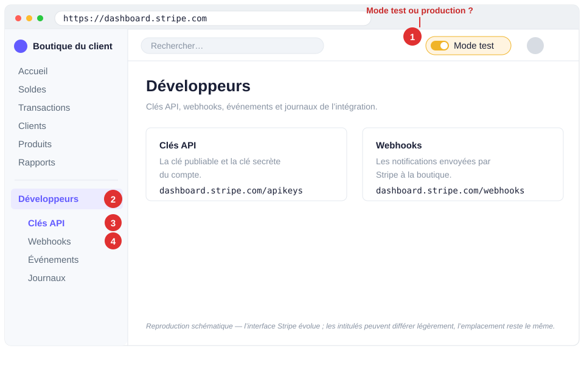
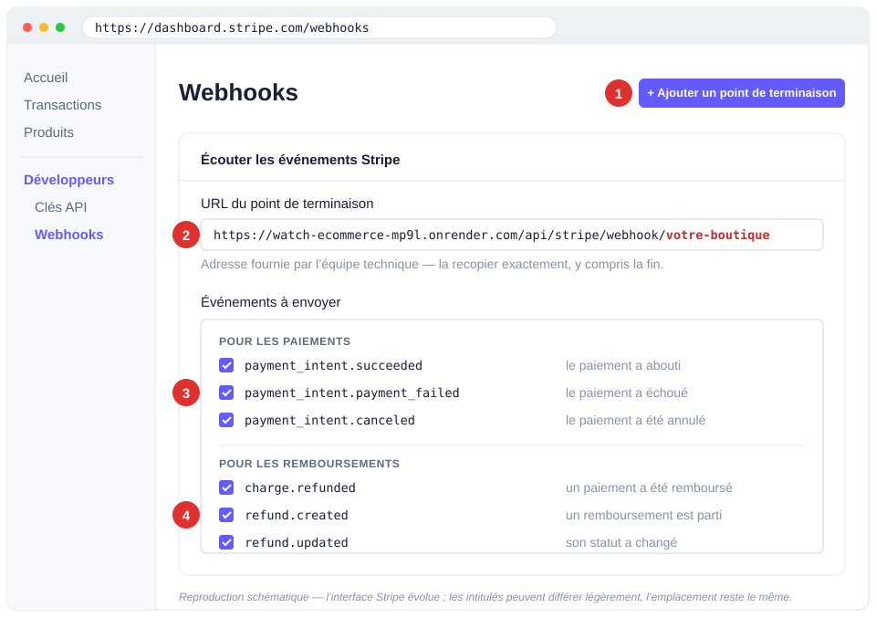
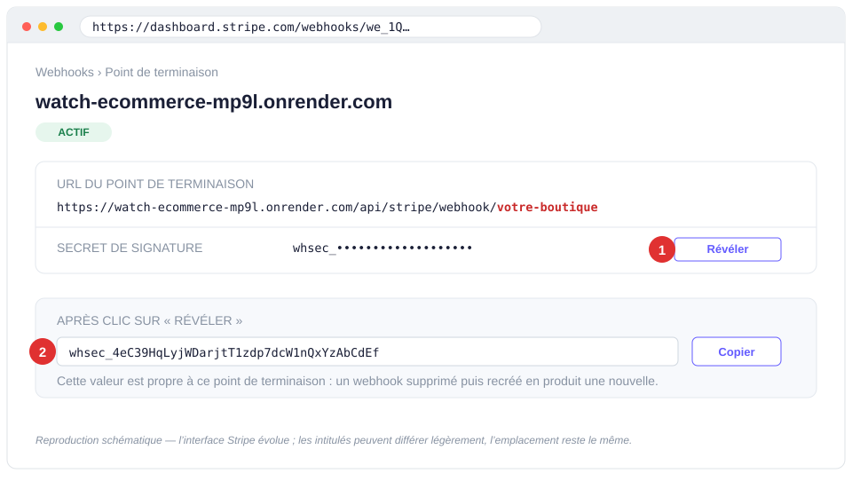
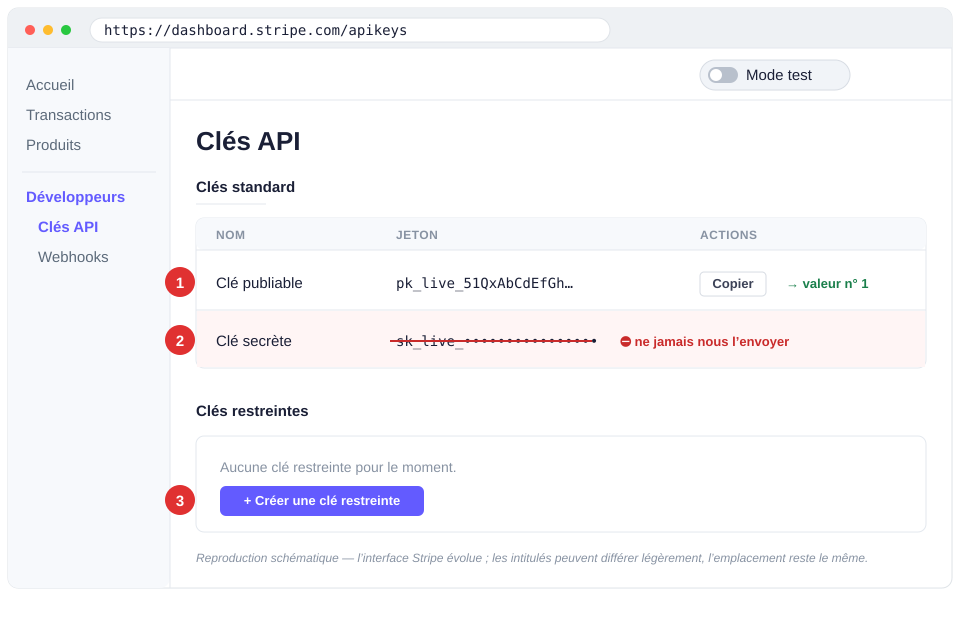
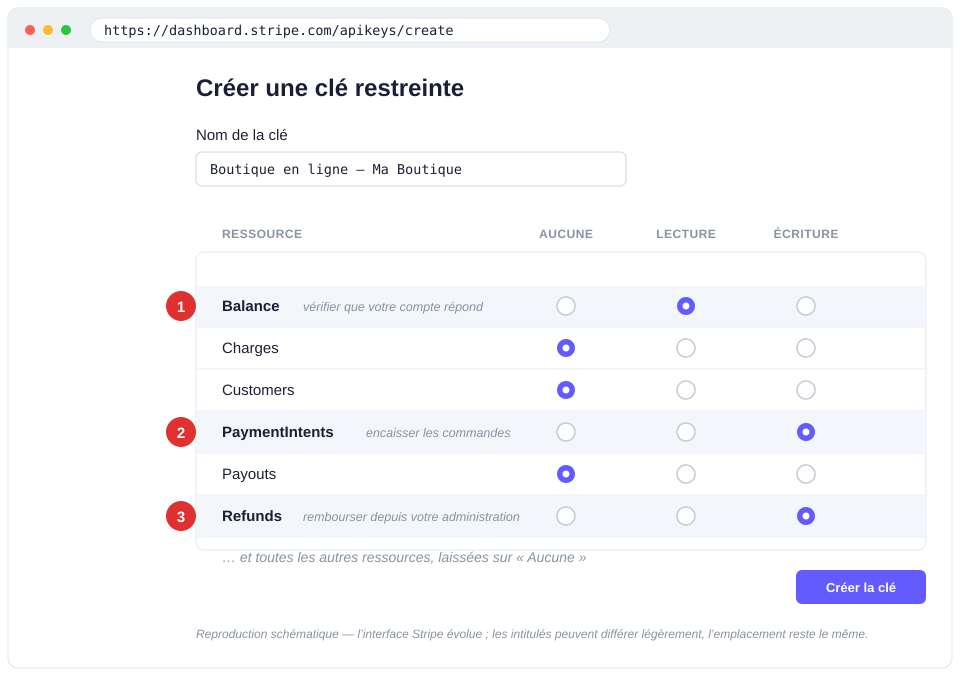

# Mettre en place les paiements de votre boutique — guide Stripe

Ce guide vous permet de créer et configurer **votre** compte Stripe, seul, de bout en bout.
Comptez **30 à 45 minutes** de manipulation, plus le délai de vérification par Stripe
(généralement quelques heures à 2 jours ouvrés).

## Ce qu'il faut savoir avant de commencer

**Le compte est le vôtre, et le restera.** Il est créé à votre nom, avec votre société et
votre IBAN. L'argent des ventes va directement sur votre compte bancaire, sans passer par
nous. Vous seul accédez à votre tableau de bord Stripe.

**Nous n'aurons jamais accès à votre compte.** À la fin de ce guide, vous nous transmettez
trois codes techniques qui permettent au site d'encaisser vos ventes — et, si vous le
souhaitez, de déclencher un remboursement depuis l'administration de votre boutique. Ces
codes ne permettent ni de virer de l'argent vers un autre compte, ni de lire votre fichier
client, ni de modifier vos réglages. Vous pouvez les annuler vous-même à tout moment
(étape 5).

**Les remboursements, à votre main, dans l'outil que vous préférez.** L'administration de
votre boutique sait rembourser une commande, en totalité ou en partie, en un bouton : le
mouvement part de votre compte Stripe comme toujours, mais vous n'avez plus à chercher le
paiement dans le tableau de bord, ni à recopier quoi que ce soit ensuite. C'est une
permission que vous accordez à l'étape 5.2, et qui reste facultative : sans elle, vous
remboursez depuis Stripe et votre boutique enregistre l'opération automatiquement.

**Ce qui reste de votre ressort, en permanence :** les litiges avec un client, les
virements vers votre banque, votre comptabilité et votre TVA. Tout cela se fait depuis
votre tableau de bord Stripe, où nous ne sommes pas.

### Ce dont vous avez besoin sous la main

- L'adresse e-mail professionnelle qui sera propriétaire du compte
- Votre numéro SIRET et l'adresse du siège
- Une pièce d'identité du dirigeant (photo ou scan)
- L'**IBAN de la société** (pas un compte personnel)
- Un téléphone pour la double authentification

> **À propos des captures de ce guide.** Ce sont des **reproductions schématiques** du
> tableau de bord Stripe, pas des photos d'écran : elles montrent où regarder et quoi
> cliquer, pas le pixel exact. Stripe fait évoluer son interface plusieurs fois par an —
> un bouton peut changer de couleur, un intitulé d'un mot. Ce qui ne bouge pas, et sur
> quoi vous pouvez vous fier : **les adresses directes** (`dashboard.stripe.com/apikeys`,
> `dashboard.stripe.com/webhooks`) et **le début des valeurs** (`pk_`, `rk_`, `whsec_`).
> Si un écran ne ressemble pas tout à fait à l'image, cherchez le libellé, pas la forme —
> et en cas de doute, écrivez-nous plutôt que de cliquer au hasard.

---

## Étape 1 — Créer le compte

1. Allez sur **[stripe.com](https://stripe.com)** et cliquez sur **Démarrer maintenant**.
2. Utilisez **votre adresse e-mail professionnelle**. C'est cette adresse qui sera
   propriétaire du compte : évitez une adresse personnelle ou celle d'un salarié de
   passage. Une adresse partagée du type `compta@…` ou `direction@…` est un bon choix.
3. Choisissez **France** comme pays. Ce choix est **définitif** : il détermine la devise
   et la réglementation applicable, et ne peut pas être modifié après coup.
4. Activez la **double authentification (2FA)** quand Stripe vous la propose. Ne la
   reportez pas : c'est ce qui protège l'accès à votre argent.

> **Vous avez déjà un compte Stripe ?** Parfait, ne recréez rien. Connectez-vous et passez
> directement à l'étape 3. Vérifiez simplement, en haut de l'écran, que vous êtes bien sur
> le bon compte si vous en avez plusieurs.

---

## Étape 2 — Activer les paiements (vérification d'identité)

Dans votre tableau de bord, cliquez sur **Activer les paiements** (ou *Compléter le
profil*) et remplissez le formulaire :

| Information demandée | Précision |
| --- | --- |
| Type d'entreprise | SAS, SARL, EI, auto-entrepreneur… |
| SIRET / SIREN | tel qu'il figure sur votre extrait Kbis ou avis Insee |
| Adresse du siège | l'adresse officielle, pas forcément la boutique |
| Dirigeant | nom, date de naissance, pièce d'identité |
| Description de l'activité | soyez concret : « vente de montres d'occasion et neuves » |
| Site web | l'adresse de votre future boutique : `<ADRESSE-DU-SITE>` |
| Coordonnées bancaires | **IBAN au nom de la société** |
| Libellé sur le relevé bancaire | ce que vos clients liront sur leur relevé — mettez `<NOM-BOUTIQUE>`, pas un sigle : c'est le premier motif de contestation de paiement |

**Stripe vérifie votre site avant d'activer le compte.** Il doit être en ligne et
comporter des conditions générales de vente, des mentions légales, une page de contact,
une politique de retour et de remboursement, et des prix affichés en TTC. Nous mettons
tout cela en place sur votre boutique — si Stripe vous demande un site accessible et qu'il
ne l'est pas encore, dites-le nous : nous ouvrons une adresse temporaire pour débloquer la
vérification.

Stripe peut réclamer un justificatif complémentaire (Kbis, RIB, justificatif de domicile).
Répondez depuis le bandeau du tableau de bord ; tant que la demande est en attente, les
virements vers votre banque sont suspendus, même si les paiements fonctionnent.

**Délais habituels :** activation en quelques heures à 2 jours ouvrés. Le **premier
virement** vers votre banque intervient environ **7 jours** après la première vente, puis
le rythme devient roulant (tous les jours ouvrés, à J+3 en général). Ce délai initial est
normal et propre à tout nouveau compte.

---

## Étape 3 — Choisir vos moyens de paiement

**Réglages** (roue dentée, en haut à droite) → **Modes de paiement**.

Cochez ce que vous voulez proposer. Ce que vous activez ici apparaît **automatiquement**
sur votre boutique : ni développement, ni mise à jour du site de notre part. Vous pouvez
en ajouter ou en retirer à tout moment.

- **Cartes bancaires** — activé par défaut, ne le désactivez pas.
- **Apple Pay / Google Pay** — fortement recommandés : la majorité des visiteurs achètent
  depuis leur téléphone, et ces moyens évitent la saisie du numéro de carte. Une étape
  technique nous incombe, voir l'encadré ci-dessous.
- **Paiement en plusieurs fois** (Klarna, Alma…) — pertinent sur des paniers élevés ;
  chacun a sa propre commission, à comparer.
- **Virement, prélèvement SEPA** — utiles pour de gros montants, mais l'encaissement n'est
  pas instantané : la commande n'est confirmée qu'à réception des fonds.

> **Apple Pay et Google Pay — une étape à deux.** Dans **Réglages → Domaines des moyens de
> paiement**, ajoutez `<ADRESSE-DU-SITE>`. Stripe vous proposera de télécharger un fichier
> de vérification : **envoyez-le nous**, nous devons l'héberger sur le site pour que la
> validation aboutisse. Sans cette étape, les deux boutons ne s'affichent pas.

Pendant que vous y êtes, dans **Réglages → Reçus par e-mail**, activez l'envoi automatique
des reçus Stripe si vous le souhaitez. Votre boutique envoie déjà sa propre confirmation
de commande : les deux peuvent coexister, ou vous laissez celui de Stripe désactivé.

---

## Étape 4 — Créer le webhook

Le webhook est le canal par lequel Stripe prévient votre boutique qu'un paiement a
abouti. **Sans lui, les clients paient mais les commandes n'apparaissent jamais.** C'est
l'étape à ne pas rater.

**Développeurs** se trouve en bas de la colonne de gauche du tableau de bord. Le menu
s'ouvre sur deux entrées qui servent pour tout le reste de ce guide : **Clés API**
(étape 5) et **Webhooks** (ci-dessous).



Le repère **1** est le sélecteur **Mode test**. Pour encaisser de vraies ventes, il doit
rester **éteint**. La vérification qui ne trompe pas : une clé de test commence par
`pk_test_`, une clé réelle par `pk_live_`.

1. Menu **Développeurs** → **Webhooks** → **Ajouter un point de terminaison**.
2. Dans **URL du point de terminaison**, collez **exactement** cette adresse :

   ```
   https://watch-ecommerce-mp9l.onrender.com/api/stripe/webhook/<IDENTIFIANT-BOUTIQUE>
   ```

   Recopiez-la sans rien modifier, y compris la fin `<IDENTIFIANT-BOUTIQUE>` : c'est ce
   qui indique à notre serveur qu'il s'agit de votre boutique.

3. Cliquez sur **Sélectionner des événements** et cochez ces six lignes, ni plus ni
   moins :

   *Pour les paiements :*

   - `payment_intent.succeeded`
   - `payment_intent.payment_failed`
   - `payment_intent.canceled`

   *Pour les remboursements :*

   - `charge.refunded`
   - `refund.created`
   - `refund.updated`

   Les trois dernières permettent à votre boutique d'enregistrer un remboursement **quel
   que soit l'endroit d'où il part** : le bouton de votre administration, votre tableau de
   bord Stripe, ou une contestation tranchée en faveur de l'acheteur. Sans elles, une
   commande remboursée continuerait de compter dans votre chiffre d'affaires.

   > Si votre compte propose aussi `charge.refund.updated` dans la liste, cochez-la : les
   > comptes Stripe plus anciens utilisent ce nom-là. En cocher une de trop est sans effet.

4. Validez avec **Ajouter un point de terminaison**.

   

   Les repères **1** à **4** de l'image correspondent aux points 1 à 4 ci-dessus. Seule la
   fin de l'URL change d'une boutique à l'autre : c'est l'identifiant que nous vous avons
   donné, en rouge sur l'image.

5. Sur l'écran du webhook qui vient d'être créé, cherchez **Secret de signature** et
   cliquez sur **Révéler**. Une valeur commençant par `whsec_` apparaît.

   

   👉 **Copiez-la**, c'est la **valeur n° 3** de la fiche de transmission.

   Ce secret appartient à **ce** point de terminaison : si vous supprimez puis recréez le
   webhook, la valeur change et il faut nous transmettre la nouvelle.

---

## Étape 5 — Créer les clés d'accès

### 5.1 — La clé publique

Menu **Développeurs** → **Clés API**. Dans le tableau, repérez la ligne **Clé publiable**
et copiez la valeur qui commence par `pk_live_`.

👉 C'est la **valeur n° 1**. Elle est publique par nature (elle est visible dans le code
de n'importe quelle boutique) : aucun risque à nous la transmettre.



Les trois repères de l'image : **1** la clé publiable, celle qu'on vous demande ;
**2** la clé secrète, celle qu'on ne vous demandera **jamais** ; **3** le bouton qui ouvre
l'étape suivante.

### 5.2 — La clé restreinte

⚠️ **Ne nous envoyez jamais la « clé secrète » `sk_live_…` du tableau.** Celle-là donne
tous les droits sur votre compte. Créez à la place une clé limitée :

1. Toujours dans **Développeurs → Clés API**, cliquez sur **Créer une clé restreinte**.
2. Nommez-la de façon reconnaissable, par exemple `Boutique en ligne — <NOM-BOUTIQUE>`.
3. Vous voyez une longue liste de ressources, toutes sur **Aucune** par défaut. **Ne
   changez que ces trois lignes :**

   | Ressource | Réglage à choisir | À quoi ça sert |
   | --- | --- | --- |
   | **PaymentIntents** | **Écriture** | encaisser les commandes de la boutique |
   | **Balance** | **Lecture** | vérifier que votre compte répond (supervision) |
   | **Refunds** | **Écriture** | rembourser une commande depuis votre administration |

   Tout le reste doit rester sur **Aucune**. En particulier : laissez **Payouts**,
   **Customers** et **Settings** sur *Aucune* — personne d'autre que vous ne doit pouvoir
   virer des fonds, lire votre fichier client ou changer vos réglages.

   > **La ligne Refunds est facultative.** Ce qu'elle autorise est borné : rendre tout ou
   > partie d'un paiement encaissé sur votre boutique, **à l'acheteur qui l'a réglé**, sur
   > son moyen de paiement d'origine. Il n'existe aucun moyen d'envoyer cet argent
   > ailleurs. Si vous préférez garder ce geste dans votre tableau de bord, laissez cette
   > ligne sur *Aucune* et dites-le nous : votre boutique enregistrera quand même vos
   > remboursements automatiquement, elle n'affichera simplement pas le bouton.

   

   Les trois repères de l'image sont les trois seules lignes à changer. La liste réelle est
   bien plus longue que celle dessinée ici — faites défiler sans rien toucher d'autre.

4. Créez la clé. La valeur `rk_live_…` s'affiche : **copiez-la immédiatement**, elle n'est
   affichée en entier qu'une seule fois. Si vous la perdez, supprimez la clé et
   recommencez, ce n'est pas grave.

👉 C'est la **valeur n° 2**.

**Concrètement, cette clé permet uniquement** d'encaisser une commande passée sur votre
boutique, de vérifier que votre compte répond, et — si vous avez coché *Refunds* — de
rembourser une de ces commandes à son acheteur. Elle ne permet pas de virer des fonds vers
un compte, de consulter votre chiffre d'affaires détaillé, de lire votre fichier client ni
de modifier quoi que ce soit dans vos réglages.

**Vous gardez la main :** à tout moment, depuis cette même page, vous pouvez révoquer
cette clé d'un clic. Le site cessera simplement d'accepter les paiements jusqu'à ce que
vous nous en fournissiez une nouvelle. Nous vous recommandons de le faire le jour où notre
collaboration s'arrête.

---

## Étape 6 — Nous transmettre les trois valeurs

Reportez-vous à la **[fiche de transmission](03-fiche-de-transmission.md)**. Elle indique
le canal sécurisé à utiliser.

⚠️ **N'envoyez jamais ces valeurs par e-mail, SMS, WhatsApp ou message instantané.** Ces
canaux gardent une copie durable, souvent sauvegardée et consultable par d'autres
personnes que vous.

---

## Questions fréquentes

**Combien Stripe prélève-t-il ?**
Une commission par transaction, retenue à la source, variable selon le moyen de paiement
et le pays de la carte. Les tarifs à jour sont sur [stripe.com/fr/pricing](https://stripe.com/fr/pricing).
Nous ne prélevons aucune commission sur vos ventes et ne sommes pas intermédiaires de
paiement.

**Comment rembourser un client ?**
Depuis l'administration de votre boutique : **Commandes**, ouvrez la commande, panneau
*Retour et remboursement*, bouton **Rembourser**. Total ou partiel, avec une confirmation
avant validation. L'argent part de votre compte Stripe et revient sur la carte de
l'acheteur en 5 à 10 jours ouvrés ; la commande, vos statistiques et votre comptabilité
sont mises à jour toutes seules, sans rien recopier.

Vous pouvez aussi continuer à rembourser depuis votre tableau de bord Stripe : votre
boutique le détecte et l'enregistre de la même façon. Les deux chemins mènent au même
résultat — c'est le même compte, le même argent.

Un point à connaître : **Stripe ne vous restitue pas la commission** prélevée sur le
paiement initial. Un remboursement total vous laisse donc de cette commission à votre
charge, quel que soit l'endroit d'où vous le déclenchez.

**Un client conteste un paiement, que faire ?**
Stripe vous alerte par e-mail et vous ouvre un délai pour répondre avec vos preuves
(facture, preuve de livraison, échanges). Répondez depuis le tableau de bord, dans la
section **Litiges**. Ne remboursez pas en parallèle : cela ne clôt pas la contestation.

**Puis-je tester sans encaisser de vrai argent ?**
Oui, c'est même ce que nous faisons ensemble avant l'ouverture. Un interrupteur **Mode
test** est présent dans votre tableau de bord ; il donne accès à un jeu de clés distinct.
Si nous vous demandons des clés de test, la démarche est identique à celle des étapes 4 et
5, mode test activé.

**Que se passe-t-il si je révoque la clé par erreur ?**
Le site n'encaisse plus, et affiche une erreur au moment du paiement. Recréez une clé
restreinte (étape 5.2), transmettez-la nous : le rétablissement prend quelques minutes.
Aucune commande déjà passée n'est perdue.

**Une question sur ce guide ?**
Écrivez-nous à `<TON-EMAIL>`. Pour toute question sur votre compte lui-même (vérification,
virements, litiges), le support Stripe est joignable depuis votre tableau de bord.
